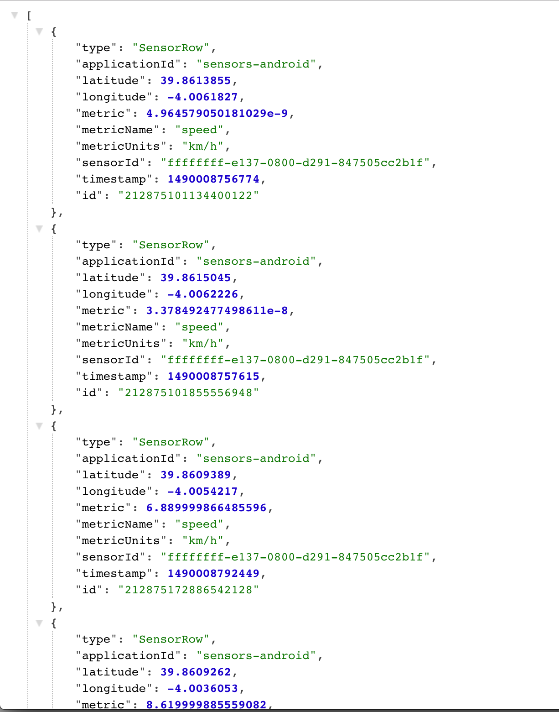
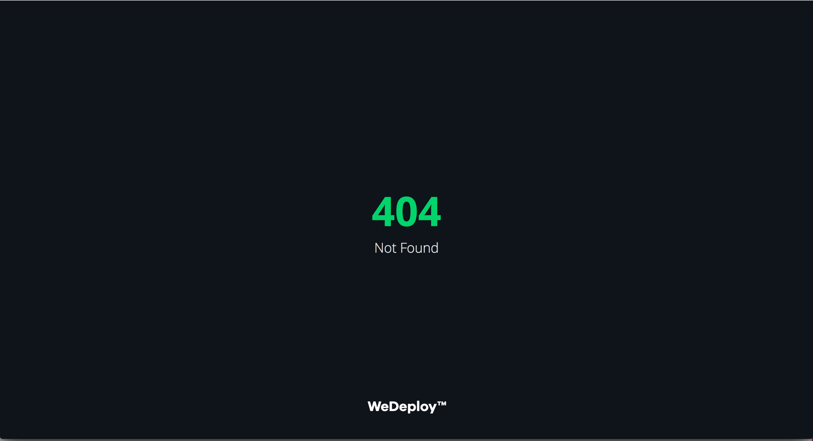
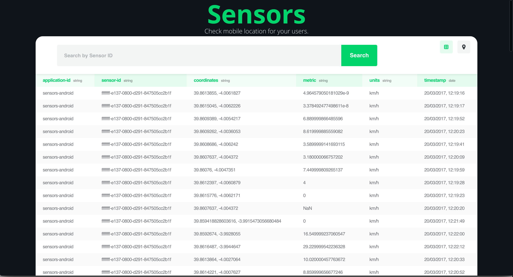
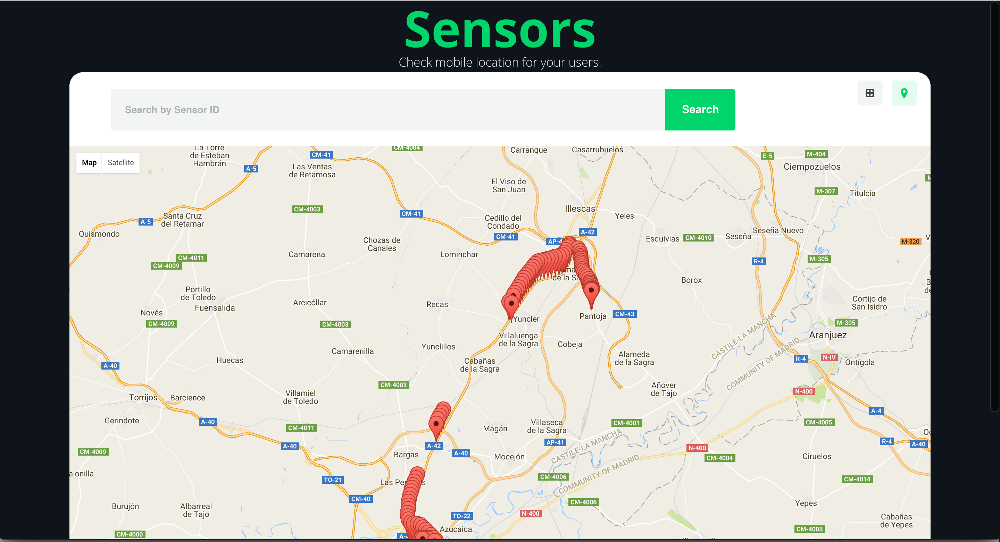
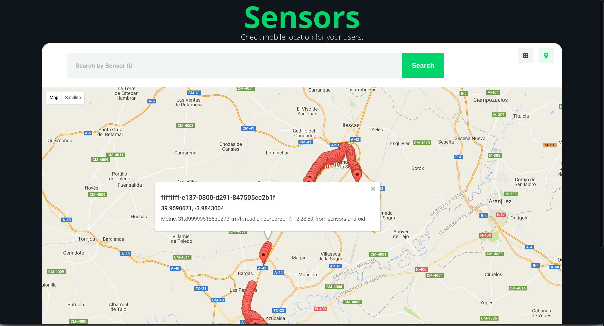
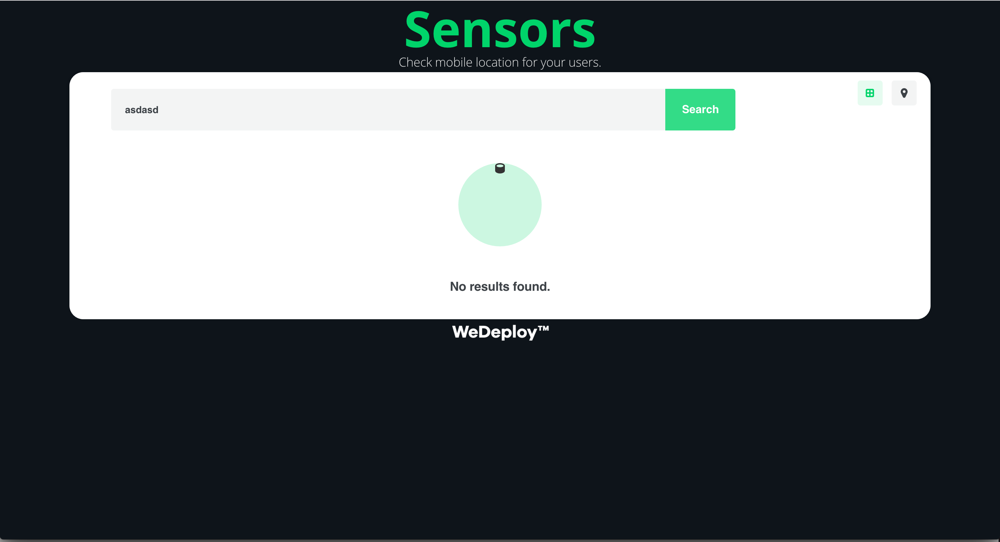

# Práctica Sensores y Plataformas

    Alumno: Manuel de la Peña
    D.N.I.: 53.430.012-T
    Asignatura: Computación Ubícua
    Máster de Investigación en Ingeniería del Software y Sistemas Informáticos
    Curso: 2016-2017
    Universidad Nacional de Educación a Distancia (U.N.E.D.)

Para acceder en modo online a este documento, por favor visite [el siguiente enlace](https://github.com/mdelapenya/uned-sensors-wedeploy/blob/master/README.md)

## Enunciado de la práctica

Estudiar y proponer la integración de información sensorial sobre una plataforma de servicio para el
Internet de las Cosas (IoT).

## Descripción de la práctica

La práctica consiste en la utilización de las plataformas para el Internet de las Cosas para integrar
información sensorial (preferiblemente con el sensor definido en la PEC2, MIVELOCIDAD1) y proponer una
aplicación sobre la plataforma elegida con esta información.

Se puede utilizar cualquiera de las siguientes plataformas OpenSource:

* Kaa: Independiente de plataforma - C SDK [https://www.kaaproject.org](https://www.kaaproject.org)
* Macchina.io: Linux - JavaScript/C++ [https://macchina.io](https://macchina.io)
* Iotivity: Independiente de plataforma - C/C++ [https://www.iotivity.org](https://www.iotivity.org)
* SiteWhere: Linux - Java [http://www.sitewhere.org](http://www.sitewhere.org)

También es posible utilizar otro tipo de plataforma no OpenSource como puede ser principalmente Autodesk
Fusion Connect, AWS (Amazon Web Services), Google Cloud IoT, Microsoft Azure IoT, IBM Watson IoT o
ThingWorx, teniendo en cuenta las limitaciones correspondientes a cada caso en las versiones "free".

## Arquitectura de la solución

La solución constará de 2 desarrollos independientes: por un lado la aplicación Android desarrollada
con anterioridad, para representar los cambios de velocidad y posición del GPS del dispositivo móvil
en el que se instala, y por otro lado el desarrollo de una plataforma IoT donde se almacenarán y
representarán las métricas enviadas por los dispositivos que instalen la aplicación.

Para consultar la documentación relativa a la aplicación Android desarrollada con anterioridad, actualizada
con el desarrollo necesario para comunicarse con la plataforma IoT, puede seguirse [el siguiente enlace](https://github.com/mdelapenya/uned-sensors/blob/master/README.md).

En el escenario del trabajo propuesto, y por simplicidad, se ha optado por desarrollar una plataforma
IoT específica para el trabajo, que constará de tres piezas, todas alojadas en un PaaS (*Platform as
a Service*) representando la plataforma IoT:

* API REST para manejar los recursos asociados a métricas: envío y consulta de métricas.
* Almacenamiento persistente de métricas.
* Interfaz de usuario para la visualización de las métricas almacenadas.

Cada pieza será representada por un microservicio, de modo que éste pueda ser evolucionado y escalado
de manera independiente. Será la plataforma IoT la que ofrezca las capacidades de **Registro** y
**Descubrimiento de servicios** de manera transparente al desarrollador: simplemente por estar
desplegadas las aplicaciones en la plataforma, éstas tendrán visibilidad las unas con las otras.

## Plataforma IoT

Para la implementación de la plataforma se ha obtado por realizar un desarrollo propio a medida, en
lugar de utilizar una plataforma ya consolidada como podría ser `Kaa Platform`. La principal razón
de utilizar este enfoque es el de desarrollar la plataforma desarrollada de manera específica para la
lectura de métricas desde los sensores, sin tener que aprender a utilizar, configurar y operar un
sistema de terceros por completo. Por ello, se ha elegido utilizar un PaaS como es [WeDeploy](http://www.wedeploy.com),
que permite desplegar servicios en su plataforma, gestionando dichos servicios como repositorios Git.

En concreto, permite construir fácilmente APIs que ayuden a la creación de aplicaciones modernas,
proporcionando un conjunto de servicios listos para ser utilizados, permitiendo almacenar datos en el
cloud, buscar y enviar contenido en tiempo real, autenticar usuarios, enviar emails, entre otros
servicios cloud.

<!-- TODO más sobre WeDeploy -->

## Modelo de Datos

En cuanto al modelo de datos que manejará la plataforma, se pretende almacenar aquellos datos enviados
por las aplicaciones que comuniquen con la misma, mediante el API expuesto por uno de los microservicios
antes mencionados. Para ello, se definirá el siguiente modelo de datos, con las consiguientes relaciones
entre entidades del modelo:

* Un Sensor podrá enviar 1 ó N Métricas desde 1 ó N Aplicaciones.
* Una Métrica sólo puede pertenecer a 1 Sensor, pero podrá ser enviadad desde 1 ó N Aplicaciones.

De este modo, un sensor en una aplicación podrá enviar N métricas; una métrica de un sensor podrá ser
enviada desde N aplicaciones; y una métrica enviada desde una aplicación podrá ser leída de un único
sensor.

Por tanto, se establece una relación ternaria entre Sensor, Aplicación y Métrica, donde la clave
primaria vendrá definida por el identificador del sensor, el identificador de la aplicación, y los
identificadores de la métrica, que en este caso será la marca de tiempo asociada al envío de la
métrica.

### Sensor

Únicamente recogeremos el identificador del sensor, por tanto la entidad sólo tendrá un campo de tipo
`String` almacenando dicho ID único.

Para el sensor representado por la aplicación Android, el identificador se obtiene de la siguiente
manera:

```java
private String getUniqueDeviceId() {
    TelephonyManager telephonyManager =
        (TelephonyManager)getSystemService(Context.TELEPHONY_SERVICE);

    final String deviceId = telephonyManager.getDeviceId(); // identificador del dispositivo
    final String simSerialNumber = telephonyManager.getSimSerialNumber(); // número de serie de la SIM
    final String androidId = android.provider.Settings.Secure.getString(
        getContentResolver(), android.provider.Settings.Secure.ANDROID_ID); // identificador de Android

    UUID deviceUuid = new UUID(
        androidId.hashCode(), ((long)deviceId.hashCode() << 32) | simSerialNumber.hashCode());

    return deviceUuid.toString();
}
```

Otros sensores que quieran contribuir sus métricas a la plataforma tendrán que calcular el identificador
del sensor de alguna manera, por ejemplo en base al hardware del sensor.

### Métricas

El dispositivo emitirá señales indicando su posición actual, expresada en coordenadas latitud y longitud,
el valor de su métrica, el identificador de la métrica, las unidades en que se expresa la métrica, el
identificador de la aplicación que lo envía, y la fecha de obtención del dato, de modo que éstos serán
enviados a la plataforma IoT por dispositivo, y almacenados en ella con cada envío.

El sensor enviará las coordenadas de su ubicación puesto que al estar instalado en un dispositivo móvil
como es un terminal Android, éste podrá moverse y cambiar su ubicación.

## Microservicios de la plataforma en el PaaS WeDeploy

Para obtener más información sobre los microservicios desarrollados, por favor consultar los siguientes
enlaces, relativos a cada una de los elementos software del proyecto:

* [API REST](./sensors-api/README.md)
* [Almacenamiento persistente de métricas](./sensors-data/README.md).
* [Interfaz de usuario](./sensors-ui/README.md).

## Desarrollo

### Lenguaje de programación

Para los microservicios alojados en **WeDeploy** se han elegido tres tecnologías diferentes: para el API
REST se ha escogido el lenguaje Java en su versión 8, implementado mediante Spring Boot; para la
aplicación de interfaz de usuario que representará las métricas almacenadas, se ha escogido utilizar
HTML5, CSS3 y Javascript del lado del cliente; y para el almacenamiento persistente NoSQL se ha
utilizado `ElasticSearch`, que es el almacenamiento ofrecido de forma predefinida por el PaaS **WeDeploy**.

### Sistema de Build

El único microservicio que tiene un sistema de Build es el del API, puesto que los otros dos servicios
se refieren a contenido estático no compilado. Para acceder a la documentación de este microservicio
de API por favor consulte [el siguiente enlace](./sensors-api/README.md#sistema-de-build).

### Organización del código

Para agrupar los tres microservicios que compondrán el stack de la aplicación, API REST, datos e
interfaz de usuario, se ha creado un único proyecto en blanco, en el que se han creado un directorio
por cada uno de los microservicios a desarrollar.

Para consultar la estructura y organización del código de cada microservicio, consulte el fichero
`README.md` de cada servicio individual.

* [API REST](./sensors-api/README.md#estructura-del-proyecto)
* [Almacenamiento persistente de métricas](./sensors-data/README.md#estructura-del-proyecto).
* [Interfaz de usuario](./sensors-ui/README.md#estructura-del-proyecto).

## Pruebas

Un requisito imprescindible en toda aplicación es la escritura de buenos tests. Se consideran como
buenas prácticas de escritura de tests las siguientes:

* Un buen test tiene una única razón para fallar.
* Un buen test verifica una única cosa del código a probar.
* Un buen test evita la lógica condicional.
* Un buen test tiene un nombre que describe de manera clara el caso de prueba. Por contra, no se puede
confiar en un test cuya implentación no tiene nada que ver con el nombre del método de test.
* Un buen test crea/abre los recursos que necesita antes de su ejecución, y los cierra o borra al final
de su ejecución.
* Un buen test no define de manera explícita sus dependencias (*hardcoded dependencies*).
* Un test que falla de manera constante es inútil.
* Un test que no puede fallar no aporta valor, pues crea una falsa sensación de seguridad.

### Tests unitarios

Debido a la simplicidad del proyecto, no se han escrito tests unitarios para los microservicios.

### Tests de integración

<!-- TODO -->

### Exploratory Testing

Se han realizado pruebas exploratorias (o `Exploratory Testing`) sobre la aplicación, de modo que
todos los controles han sido extensamente probados, utilizando diferentes prácticas: valores límite,
valores incorrectos, valores nulos en los campos, etc.

## Manual de Uso

A continuación se presentan las diferentes pantallas de la aplicación, con la información necesaria
para utilizar la aplicación con fluídez.

### Aplicación Android

En cada cambio de posición realizado por el dispositivo Android, siempre y cuando la aplicación esté
abierta y en primer plano, se enviará una métrica a la plataforma IoT.

[Manual de uso de la aplicación Android](https://github.com/mdelapenya/uned-sensors#manual-de-uso)

### Plataforma IoT

A continuación se presentan las URLs de los diferentes elementos que componen la plataforma:

* API (todas las métricas): [http://api.mdelapenya-sensors.wedeploy.io/sensors](http://api.mdelapenya-sensors.wedeploy.io/sensors)
* API (métricas de un sensor): [http://api.mdelapenya-sensors.wedeploy.io/sensors/ffffffff-e137-0800-d291-847505cc2b1f](http://api.mdelapenya-sensors.wedeploy.io/sensors/ffffffff-e137-0800-d291-847505cc2b1f)
* Interfaz de Usuario: [http://ui.mdelapenya-sensors.wedeploy.io](http://ui.mdelapenya-sensors.wedeploy.io)

#### Obtención de todas las métricas almacenadas

Accediendo a la URL [http://api.mdelapenya-sensors.wedeploy.io/sensors](http://api.mdelapenya-sensors.wedeploy.io/sensors), la aplicación representando el
API responderá a la petición con el resultado de consultar al almacenamiento persistente sin filtros,
de modo que devolverá todas las métricas almacenadas. La respuesta de la petición estará en formato
JSON.



#### Obtención de todas las métricas almacenadas para un sensor en concreto

Accediendo a la URL [http://api.mdelapenya-sensors.wedeploy.io/sensors/:sensorId](http://api.mdelapenya-sensors.wedeploy.io/sensors/:sensorId), donde `:sensorId`
representa el identificador de sensor de interés, la aplicación del API responderá a la petición con
el resultado de consultar al almacenamiento persistente filtrando por la columna `sensorId`, de modo
que devolverá todas las métricas almacenadas para el sensor especificado como parámetro. La respuesta
de la petición estará en formato JSON.


Si no hubiese ninguna métrica almacenada para dicho identificador, lo que indica que el sensor no
existe en la plataforma, un mensaje de error 404 de HTTP será retornado en la respuesta.



#### Interfaz de Usuario

Accediendo a la URL http://ui.mdelapenya-sensors.wedeploy.io se mostrará el interfaz de usuario que
mostrará las métricas almacenadas en la plataforma. Nada más acceder a la aplicación, se cargarán
todas las métricas disponibles, en un formato tabular.



Al lado del botón de buscar, a la derecha, se encuentran dos iconos. Uno de ellos representando un
grid, y otro un pin. Seleccionando el icono de grid se mostrará el formato tabular antes mencionado,
mientras que seleccionando el icono de pin se mostrarán todas las métricas en un mapa.



Este mapa aparecerá centrado en función a todas las métricas almacenadas, en el centro geométrico de
todas ellas. Cada métrica será representada por un `pin` rojo, que al ser clicado mostrará en una
ventana emergente la información de la métrica.



Si utilizamos la caja de búsqueda, introduciendo un identificador de sensor que no exista, y pulsamos
el botón de buscar, se mostrará un mensaje de información indicando que no existen métricas para el
sensor seleccionado.



## Instalación de la aplicación

### Aplicación Android

Para instalar la aplicación Android, será necesario seguir el siguiente tutorial:

[Manual de instalación de la aplicación Android](https://github.com/mdelapenya/uned-sensors#instalación-de-la-aplicación)

### Plataforma IoT

## Integración con otros sistemas

Cualquier dispositivo que quiera almacenar sus métricas en la plataforma. Únicamente tendrá que enviar
peticiones `HTTP POST` a la plataforma, siguiendo la especificación definida por el API REST.

Por ejemplo, una simple petición `curl` sería suficiente para enviar una métrica, siempre y cuando se
envíen los datos adecuados en formato JSON:

```shell
curl -v -H "Content-Type: application/json" -X POST -d '{"sensorId":"abcdefghijk","applicationId":"sensors-curl","latitude":"40.98765","longitude":"-1.12345","metric":"24", "metricUnits":"Celsius","metricName":"temperature","timestamp":"1489055420416"}' http://api.mdelapenya-sensors.wedeploy.io/sensors
```

Por tanto, para enviar una métrica será necesario por tanto enviar una cabecera indicando que el
`Content-type` a utilizar durante el intercambio de datos será *JSON*, el verbo HTTP a utilizar será
*POST*, y la URL que recibirá la petición será la definida por el recurso `/sensors` en la plataforma
`http://api.mdelapenya-sensors.wedeploy.io`. En lo que a los datos se refiere, es necesario enviar:

* el identificador del sensor
* el identificador de la aplicación
* las coordenadas en formato latitud y longitud
* el valor de la métrica
* las unidades de la métrica
* el nombre de la métrica
* una marca de tiempo de la petición

## Recursos

Spring Boot: https://spring.io/guides/gs/actuator-service
Spring Boot, construyendo servicios REST: https://spring.io/guides/tutorials/bookmarks/#_building_a_rest_service
Spring Boot, sirviendo contenido web: https://spring.io/guides/gs/serving-web-content
