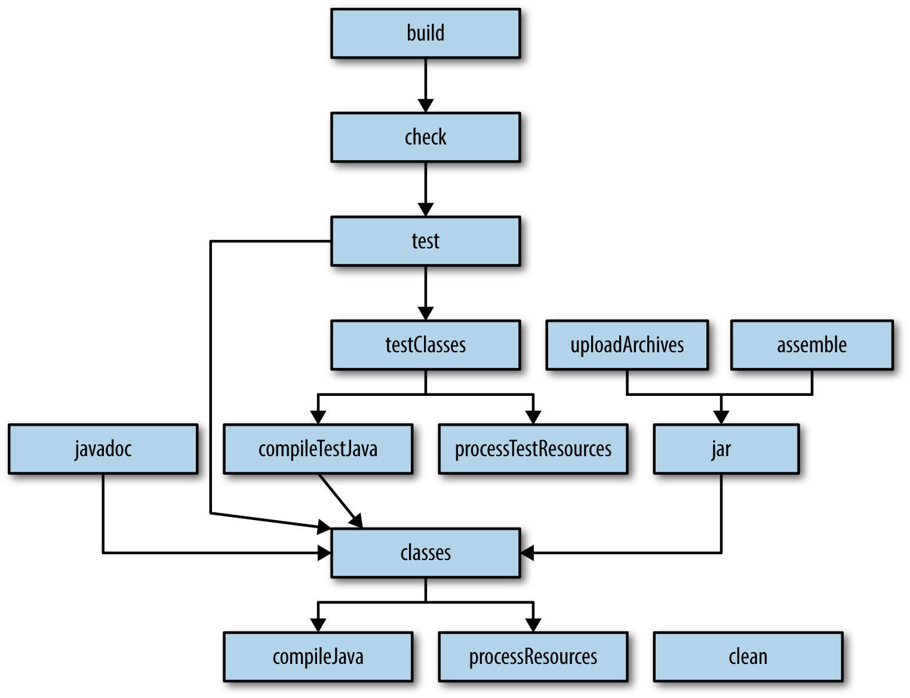
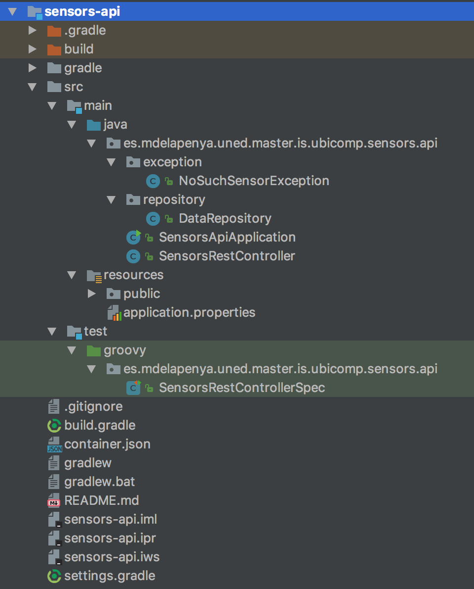

# Microservicio de API

Este microservicio será el responsable de recibir las peticiones de consulta y modificación de métricas,
enviando dichas peticiones al almacenamiento persistente, que será implementado por otro microservicio
(ver [aquí](../sensors-data/README.md)). Para ello, el API REST ha sido escrito en lenguaje Java en
su versión 8, implementado mediante `Spring Boot`.

La plataforma IoT a desarrollar debe exponer los siguiente recursos REST (o *endpoints*):

* `GET /sensors`: Obtención de todos las métricas de todos los sensores que han enviado al menos una
vez datos a la aplicación.
* `GET /sensors/:sensorId`: Obtención de todos las métricas de un sensor, identificado por su
identificador.
* `POST /sensors`: Envío de una métrica desde un sensor. Los valores que acepta el servicio son los
siguientes:

* el identificador del dispositivo, por ejemplo `ffffffff-e137-0800-d291-847505cc2b1f`.
* el ID de la aplicación, que tendrá siempre como prefijo la palabra `sensors-`, seguido por el
identificador de la plataforma en la que está instalada, por ejemplo `sensors-android`, `sensors-ios`, etc.
* las coordenadas en formato latitud y longitud.
* el valor de la métrica, por ejemplo `4.25`.
* el tipo de métrica, en formato texto. Ejemplos de este valor podrían ser `"speed"`, `"temperature"`,
`"pressure"`, etc.
* las unidades en que se expresa la métrica, en formato texto, por ejemplo `"km/h"`, `"Celsius"`,
`"bar"`, etc. 
* un timestamp con la marca de tiempo del momento de la petición.

## Sistema de Build

Para la construcción del microservicio que representa el API, tal y como es habitual en los proyectos
*Java*, se ha utilizado **Gradle**, en su versión 3.3.

### Alternativas en el sistema de build para aplicaciones de la JVM

El ecosistema JVM se encuentra dominado por tres herramientas de build:

* Apache Ant con Ivy como gestor de dependencias
* Maven
* Gradle

#### Apache Ant + Ivy

`Ant` fue la primera herramienta moderna de build. En muchos aspectos es similar a `Make`. Fue lanzada
en el año 2000, y en un periodo corto de tiempo consiguió ser la herramienta de build más popular para
proyectos Java. Tiene una curva de aprendizaje pequeña, lo que permite a cualquiera comenzar a utilizarla
sin ninguna preparación especial, Está basado en la idea de la programación procedural.

Tras su lanzamiento inicial, fue mejorada con el soporte para añadir plugins.

Por otro lado, su mayor incoveniente siempre ha sido el uso de XML como formato para la escritura de
los scripts de construcción. XML, debido a su naturaleza jerárquica, no es un buen candidato para el
enfoque procedural de programación que `Ant` utiliza. Otro problema importante con `Ant` es que el
XML que utiliza tiende a convertirse en inmanejablemente grande, tanto en proyectos grandes como
pequeños.

#### Maven

`Maven` fue lanzado en 2004. Su objetivo era el mejorar los problemas que los desarrolladores tenían
al usar `Ant`. Continúa utilizando XML como el formato de escritura de los scripts de construcción,
sin embargo es diametralmente diferente a `Ant` en su estructura: mientras `Ant` obliga a los
desarrolladores a escribir todos los comandos que llevan a la ejecución satisfactoria de algunas tareas,
`Maven` se apoya en convenciones y proporciona unos `target` (goals, u objetivos) que pueden ser
invocados. Otras mejoras, y problamente las más importantes, son que `Maven` introdujo la habilidad
de descargar dependencias de la red, que luego `Ant` adoptó mediante el proyecto `Apache Ivy`. Este
nuevo enfoque de gestión de dependencias revolucionó la manera de entregar software.

Sin embargo, `Maven` tiene sus propios problemas. La gestión de dependencias que hace no maneja de
manera correcta los conflictos entre diferentes versiones de la misma librería, algo en lo que `Ivy`
es mucho mejor. Además, XML como formato de configuración es muy estricto en su estructura, así como
muy estandarizado. La personalización de los `targets` es compleja, por ello, al estar `Maven` más
enfocado en la gestión de las dependencias, es más dificil escribir complejos scripts de construcción
personalizados en `Maven` que en `Ant`.

El principal beneficio de utilizar `Maven` es su ciclo de vida. Mientras un proyecto se adhiera a unos
estándares, con `Maven` se puede adaptar el ciclo de vida con cierta facilidad. Como contrapartida,
esta adaptación disminuye la flexibilidad.

#### Gradle

Hoy día existe cierto interés creciente en los DSLs (Domain Specific Languages), en los que la idea
es disponer de lenguajes diseñados específicamente para solucionar problemas de cierto dominio. Aplicado
al mundo de los sistema de build, uno de los resultados de aplicar DSL es `Gradle`.

`Gradle` combina las buenas partes de las dos herramientas anteriores y construye sobre ellas utilizando
un DSL, entre otras mejoras. Dispone de la potencia y la flexibilidad de `Ant`, así como la facilidad
a la hora de definir un ciclo de vida de `Maven`. El resultado final es una herramienta que fue
lanzada en 2012, y obtuve mucha atención en muy poco tiempo. Por ejemplo, Google adoptó `Gradle` como
herramienta de build por defecto para el sistema operativo Android.

`Gradle` no utiliza XML. En su lugar, tiene su propio DSL basado en `Groovy`, un lenguaje de la JVM.
Como resultado, los scripts de construcción de `Gradle` tienden a ser mucho más pequeños y limpios
que aquéllos escritos con `Ant` o `Maven`. La cantidad de código repetitivo es mucho menor, puesto
que su DSL está diseñado para resolver un problema en concreto: mover el software a través de su ciclo
de vida, desde la compilación, pasando por el análisis estático de código y el testing, hasta el
empaquetado y el despliegue. En sus inicios, `Gradle` utilizaba `Apache Ivy` para la gestión de
dependencias, pero más adelante pasó a utilizar un motor de resolución propio.

Los esfuerzos de `Gradle` se podrían resumir en la frase “la convención es buena, así como la flexibilidad”.

Gradle proporciona:

* una herramienta de construcción de propóstio general y muy flexible, parecido a Apache Ant.
* proporciona frameworks intercambiables, basados en construcción-por-convención, al estilo de Maven.
* soporte de construcción de proyectos multi-proyecto muy potente.
* gestión de dependencias muy potente, basado en Apache Ivy.
* soporte completo para infraestructuras de repositorios Maven o Ivy existentes.
* soporte para gestión de dependencias transitivas, sin la necesidad de repositorios remotos, o ficheros
`pom.xml` o `ivy.xml`.
* tareas Ant y construcciones tratadas como ciudadanos de primera clase.
* scripts de construcción de `Groovy`.
* un modelo de dominio muy rico para describir el sistema de construcción de cada proyecto.

En el caso concreto de Spring Boot, para el microservicio que representa el API, no se utiliza nada
fuera del estándar, basando el sistema de construcción en el *default* que ofrece el plugin de Spring
Boot. Por ello, las tareas de construcción utilizadas son: `clean`, `build`, `test`.

El diagrama de interacción entre las diferentes tareas de Gradle es el siguiente:



En cuanto a la gestión de dependencias, se utilizan los repositorios de `jcenter`, los propios de
`Spring`, los repositorios de `jitpack.io`, que son una abstracción de proyectos alojados directamente
en `Github` obteniendo sus releases, y por último la instalación local de Maven, ubicada en `$USER_HOME/.m2`,
tal y como se observa en el fichero *build.gradle*.

```groovy
repositories {
  mavenLocal()
  jcenter()
  mavenCentral()
  maven { url "http://repo.spring.io/release" }
  maven {
    url "https://jitpack.io"
  }
}
```

## Dependencias externas

El microservicio de API utiliza un conjunto de clases Java de propósito general, escritas para abstraer
el modelo de datos de la aplicación. Estas clases, empaquetas en la librería `sensors-pojo-api.jar`,
constituyen un proyecto independiente, disponible en [el siguiente enlace](https://github.com/mdelapenya/uned-sensors-pojos-api).

Se ha tomado esta consideración para poder reutilizar tales clases tanto en este microservicio, como
en la aplicación Android, de modo que ambas utilicen las mismas versiones de la librería. En este caso,
se ha optado por utilizar la versión definida por el último commit en la rama `master` del repositorio:

```groovy
dependencies {
  compile 'com.github.mdelapenya:uned-sensors-pojos-api:master-SNAPSHOT'
  ...
}
```

Por otro lado, es necesario utilizar una librería cliente de **WeDeploy**, en este caso para el lenguaje
de programación Java. Esta librería se encuentra disponible en Github, de modo que pueda ser gestionada
su dependencia mediante **jitpack**.

```groovy
dependencies {
  ...
  compile("com.github.wedeploy.api-java:api:master-SNAPSHOT")
  compile("com.github.wedeploy.api-java:api-client:master-SNAPSHOT")
  ...
}
```

## Estructura del proyecto

Al utilizar Gradle como sistema de build, el proyecto sigue un `layout` específico determinado por la
convención de nombres y directorios propia de Gradle.

Según esta convención, la aplicación estará dentro de un directorio `sensors-api`, y dentro de este
directorio existirá un `src`, así como algunos ficheros descriptores, como por ejemplo el `build.gradle`.
Dentro de `src` se sigue una estructura igual a la definida por `Maven`:

* `src/main/java` para el código de la aplicación
* `src/main/resources` para los ficheros de configuración de Spring, así como los recursos estáticos
de la aplicación: páginas HTML de error y CSS, por ejemplo.
* `src/test` para los tests unitarios.
* `src/test/groovy` para los tests de integración.

En la siguiente imagen aparecen los elementos antes mencionados:



Además, el microservicio dispone de un descriptor propio de **WeDeploy**, en el que se define el
tipo de servicio en formato JSON. Al ser un proyecto basado en Java, en este descriptor se indican
además los comandos necesarios para construir el proyecto.

```json
{
    "id": "api",
    "type": "wedeploy/java:latest",
    "hooks": {
        "before_build": "",
        "build": "gradle -Dorg.gradle.native=false clean build -x test",
        "after_build": "",
        "before_start": "",
        "start": "",
        "after_start": ""
    }
}
```

Para consultar el descriptor del servicio, por favor seguir [este enlace](./container.json).

Por otro lado, en el desarrollo de la aplicación se ha utilizado una estructura de paquetes adecuada
para realizar la separación lógica entre los diferentes componentes de la misma.

A continuación se enumeran los paquetes de la aplicación, que como hemos mencionado antes, se ubican
bajo el directorio `app/src/main/java` del proyecto.

### Paquete Exception

Las clases que aquí se encuentran representan las excepciones propias escritas para identificar los
tipos de error específicos de la aplicación. Se encuentran bajo el paquete
`es.mdelapenya.uned.master.is.ubicomp.sensors.api.exception`.

En este caso, se ha escrito únicamente una clase, `NoSuchSensorException`, que será procesada cuando
el recurso asociado a un sensor identificado por su identificador no sea encontrado. Se corresponderá
con el código de estado 404 `NOT FOUND` de HTTP.

### Paquete Repository

Las clases que aquí se encuentran representan el acceso al repositorio de datos de la aplicación. Se
encuentran bajo el paquete `es.mdelapenya.uned.master.is.ubicomp.sensors.api.repository`.

En este caso, el repositorio de datos viene representado por un servicio, que será el responsable de
abstraer el acceso a los datos. Este servicio leerá y escribirá las métricas en el servicio de datos
de **WeDeploy**, que se corresponde con una instancia de almacenamiento `NoSQL` implementado con
`ElasticSearch`. 

Las operaciones que se realizarán en el repositorio de datos serán las mismas definidas por el API:
consulta de sensores, consulta de un sensor, y envío de una métrica de un sensor.

El método **findSensorById** recuperará los datos de un sensor, identificado por su identificador.
Para ello instanciará un objeto del API Java del PaaS **WeDeploy**, pasándole la URL del servicio de
datos, filtrará los resultados por el campo `sensorId` y parseará el resultado obtenido de una colección
de objetos JSON a una colección de objetos Java del tipo `SensorRow`.

```java
    public Collection<SensorRow> findBySensorId(String sensorId) {
		WeDeploy weDeploy = new WeDeploy(BASE_SENSORS_DATA_PATH);

		Response response = weDeploy.filter("sensorId", sensorId).get();

		JoddJsonParser parser = new JoddJsonParser();

		return parser.parseAsList(response.body(), SensorRow.class);
	}
```

El método **findAllSensors** recuperará los datos de todos los sensores en el repositorio. Para ello
instanciará un objeto del API Java del PaaS **WeDeploy**, pasándole la URL del servicio de datos, y
parseará el resultado obtenido de una colección de objetos JSON a una colección de objetos Java del
tipo `SensorRow`.

```java
	public Collection<SensorRow> findAllSensors() {
		WeDeploy weDeploy = new WeDeploy(BASE_SENSORS_DATA_PATH);

		Response response = weDeploy.get();

		JoddJsonParser parser = new JoddJsonParser();

		return parser.parseAsList(response.body(), SensorRow.class);
	}
```

El método **save** enviará al almacenamiento persistente los datos de una métrica. Para ello instanciará
un objeto del API Java del PaaS **WeDeploy**, pasándole la URL del servicio de datos, y realizará una
petición `POST` de HTTP con las cabeceras adecuadas (tipo del contenido y longitud del mismo) y el
objeto Java serializado a JSON.

```java
	public Response save(Metric sensorMetric) {
		WeDeploy weDeploy = new WeDeploy(BASE_SENSORS_DATA_PATH);

		String body = sensorMetric.toString();

		return weDeploy
			.header("Content-Type", "application/json; charset=UTF-8")
			.header("Content-Length", Long.toString(body.length()))
			.post(body);
	}
```

En el momento de la redacción de este documento, la serialización nativa con Jackson no está implementada,
por tanto el objeto JSON se construye mediante la concatenación de Strings en el método `toString()`
de la clase `SensorMetric`.

### Paquete raíz

En este paquete se encuentran las clases de inicialización de la aplicación, así como el controlador
principal de la misma.

Se entiende por controlador aquella clase responsable de dirigir el flujo de la aplicación de la vista
al modelo, y viceversa, en el patrón MVC (*Model - View - Controller*).

Respecto a la clase de inicialización, `SensorsApiApplication.java` se trata de una clase con un único
método `main` que utilizando `Spring Boot` realizará el startup de la aplicación.

```java
    public static void main(String[] args) {
        SpringApplication.run(SensorsApiApplication.class, args);
    }
```

En cuanto al único controlador de la aplicación, la clase `SensorsRestController.java`, podemos observar
que ésta está anotada con las anotaciones `@RestController` y `@RequestMapping("/sensors")`. Dichas
anotaciones le indican a `Spring` que enrute las peticiones HTTP al path `/sensors` a los diferentes
métodos de la clase.

Cada uno de los métodos de la clase estarán anotados a su vez con la anotación `@RequestMapping`, que
define el mapeo adecuado al verbo HTTP indicado en la parametrización de la anotación. Por ejemplo:

```java
    @RequestMapping(method = RequestMethod.DELETE)
    public Collection<SensorRow> delete() {...}

    @RequestMapping(method = RequestMethod.GET, value = "/{sensorId}")
    public Collection<SensorRow> getSensor(@PathVariable String sensorId) {...}

    @RequestMapping(method = RequestMethod.GET)
    public Collection<SensorRow> getSensors() {...}

    @RequestMapping(method = RequestMethod.POST)
    public ResponseEntity<?> track(@RequestBody Metric metric) {...}
```

Para el caso del método `getSensor(@PathVariable String sensorId)`, la anotación `@PathVariable` le
indica a `Spring` que en el path `/sensors` de la aplicación se admitirán peticiones al recurso principal,
tomando todo lo que llegue detrás de la barra tras `/sensors/` como un parámetro al método, siguiendo
los patrones de diseño de REST.

Para el caso del método `track(@RequestBody Metric metric)`, responsable de manejar las peticiones
HTTP POST que recibe la aplicación, la anotación `@RequestBody` indica que la petición debe contener
un objeto en formato JSON que pueda ser parseado al objeto `Metric`, de modo que los campos del objeto
JSON se correspondan con los atributos de la clase `Metric`. Este parseo lo realizan las clases de la
librería de serialización y parseo JSON `Jackson`, incluída por defecto en `Spring Boot`.

### Tests

En el directorio `./src/test/groovy`, en el mismo paquete raíz que el controlador que representa los
endpoints REST, se encuentra el fichero `Groovy` representando los tests que prueba las llamadas HTTP
al API, llamado `SensorsRestControllerSpec.groovy`.

Esta clase `.groovy`, que extiende la clase `Specification` de `Spock`, utiliza el ciclo de vida habitual
de los tests, disponiendo de un método de inicialización de cada test, nombrado `setupSpec` y que se
ejecuta antes de cada método de test, y un método de liberación de recursos de cada test, nombrado
`cleanupSpec` y que se ejecuta tras cada método de test.

#### Inicialización de los tests

Antes de cada método de tests se inicializa el cliente HTTP, definido en la variable con ámbito global
al test `restClient`, definiendo las cabeceras HTTP a utilizar en las llamadas, así como la gestión
de errores. Esta gestión es necesaria puesto que el API no falla ante errores, sino que devuelve los
códigos de estado adecuados, y el cliente HTTP tiene que conocer este comportamiento, de lo contrario
tratará un código de retorno distinto al 200 como un error no controlado en la ejecución.

Además, se lleva una cuenta del número de métricas que existen en el momento de la petición, de modo
que en cada inserción se pueda verificar que al invocar una petición `POST` para escribir una métrica,
se pueda realizar otra peticion `GET` de lectura y verificar que se ha incrementado el valor del total
de métricas en la plataforma.

```groovy
class SensorsRestControllerSpec extends Specification {

	@Shared
	def SENSOR_ID = "sensorId"

	@Shared
	RESTClient restClient

	@Shared
	def initialCount

	def setupSpec() {
		restClient = new RESTClient("https://sensorsapi-mdelapenya.wedeploy.io")

		restClient.headers.Accept = 'application/json'
		restClient.handler.failure  = restClient.handler.success

		def listResponse = restClient.get(path : "/sensors")
		initialCount = listResponse.data.size()
	}

	... 
}
```

#### Liberación de recursos en los tests

Tras la ejecución de cada método de tests se invoca el cliente HTTP para que realice una petición
`DELETE` sobre el recurso `/sensors/:sensorId`, donde `:sensorId` representa el identificador del
sensor a eliminar. Se ha definido una constante con ámbito global a los tests que asigna siempre el
mismo valor al parámetro, de modo que se borren los datos creados en los tests. 

```groovy

	...

	@Shared
		def SENSOR_ID = "sensorId"

	...

	def cleanupSpec() {
		restClient.delete(
			path : "/sensors/" + SENSOR_ID,
			contentType:'application/json'
		)
	}

	...

```

#### Tests que comprueban los códigos de respuesta de los diferentes endpoints GET del API

Se ha escrito un único test para verificar el código de respuesta, `def 'Check endpoints'() {...}`, y
aprovechando la potencia del framework `Spock`, se ha definido una tabla de valores por las cuales
el test itera y ejecuta un test por cada fila en una tabla de datos representando los diferentes valores
de entrada al test, así como sus respectivos valores de salida esperados.

Además, se definen con claridad los bloques `WHEN` y `THEN` habituales en los tests orientados al
comportamiento, o *BDD (Behaviour Driven Development)*, representando respectivamente los diferentes
pasos de un test:

* Dado un cliente HTTP (referido a la inicialización de los tests)
* Cuando se ejecuta una petición `GET` al recurso X (bloque WHEN)
* Entonces el estado HTTP de la respuesta es Y (bloque THEN)
* Con los valores definidos en la tabla en la que la primera columna representa el path del recurso, y
la segunda columna representa el código de respuesta esperado. (bloque WHERE)

```groovy
@Unroll("Check that #expectedHttpStatus is the HTTP status for #path endpoint")
def 'Check endpoints'() {
    when: "when requesting a resource"
    def response = restClient.get( path: path)

    then: "HTTP status is #expectedHttpStatus"
    assert response.status == expectedHttpStatus

    where:
    path            | expectedHttpStatus
    "/"             | 404
    "/sensors"      | 200
    "/sensors/foo"  | 404
}
```

#### Tests que comprueban el código de respuesta de la creación de métricas

Se ha escrito un único test para verificar que al insertar una métrica y recuperar todas las métricas
de la plataforma, la nueva métrica incrementa la cantidad de métricas en la plataforma,
`def 'Creating a metric'() {...}`.

Además, se definen con claridad los bloques `WHEN` y `THEN` habituales en los tests orientados al
comportamiento, o *BDD (Behaviour Driven Development)*, representando respectivamente los diferentes
pasos de un test:

* Dado un cliente HTTP (referido a la inicialización de los tests)
* Cuando se ejecuta una petición `POST` al recurso `/sensors` con una métrica creada a tal efecto,
con valores por defecto (bloque WHEN)
* Y además cuando se hace una petición `GET` para obtener la lista de métricas en la plataforma
(bloque AND)
* Entonces la lista contiene un elemento más que en la fase de inicialización del test (bloque THEN)

```groovy
def "Creating a metric"() {
    when: "a new metric is created"
    def metric = new SensorMetric(
        SENSOR_ID, "spock-test", 39.862846,
        -4.024904, 21, "temperature", "Celsius",
        new Date().getTime())

    restClient.post(
        path : "/sensors",
        body: metric.toString(),
        contentType:'application/json'
    )

    and: "metrics list is requested"
    def listResponse = restClient.get(path : "/sensors")

    then: "metrics list should contain one more element"
    assert initialCount +1 == listResponse.data.size()
}
```