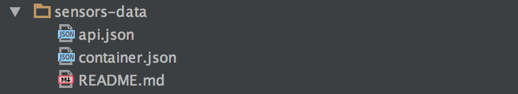

# Microservicio de Datos

Este microservicio será el responsable de recibir las peticiones de consulta y modificación de métricas
desde el microservicio del API, y realizará las operaciones de lectura y escritura en el almacenamiento
persistente. Debido a las altas capacidades de almacenamiento, la plataforma **WeDeploy** utiliza
almacenamiento desestructurado *NoSQL* para implementar la persistencia.

En este almacenamiento se definirán los mismos recursos que en el API REST, de modo que cada *endpoint*
del API estará asociado a un recurso del almacenamiento. De este modo, la aplicación creará una colección
de datos con el nombre `sensors`, que definirá el espacio de nombres sobre el que trabajarán las
aplicaciones. Por tanto, tendremos los siguientes recursos:

* `GET /sensors`: Permite recuperar todos los elementos de la colección `sensors`. Será invocado desde
el API en el método `GET` sobre el recurso `/sensors`.
* `GET /sensors/:sensorId`: Permite recuperar un único elemento de la colección `sensors`, identificado
por el identificador del sensor. Será invocado desde el API en el método `GET` sobre el recurso
`/sensors/:sensorId`.
* `POST /sensors`: Permite el almacenamiento de una métrica de un sensor. Será invocado desde el API
en el método `POST` sobre el recurso `/sensors`.

La definición de estos recursos pueden ser consultados [aquí](./api.json).

A modo de ejemplo, el siguiente bloque define en **WeDeploy** un *endpoint* para el recurso `GET /sensors`,
de tal manera que la colección `/sensors` admitirá operaciones HTTP `GET`.

```json
	{
		"description": "Returns all sensors that sent metrics to the platform",
		"path": "/sensors/*",
		"method": "GET",
		"data": true
	},
```

En el siguiente ejemplo, se define un *endpoint* para el recurso `GET /sensors/:sensorId`, de tal
manera que la colección `/sensors` admitirá operaciones `GET` de HTTP parametrizada para un único
identificador de sensor.

```json
	{
		"description": "Returns one sensor identified by its unique sensorId",
		"path": "/sensors/:sensorId",
		"method": "GET",
		"data": true
	},
```
## Estructura del proyecto

El microservicio de datos únicamente contiene dos descriptores, propios de **WeDeploy**, en formato
JSON. El primero de ellos, `api.json` determinará los *endpoints* disponibles, así como sus características.

Para consultar el descriptor de los *endpoints* disponibles, por favor seguir [este enlace](./api.json).

El segundo descriptor, `container.json`, especifica a la plataforma **WeDeploy** que el servicio actual
es del tipo `data`, así como le asigna un identificador único, en este caso `data`.

```json
{
	"id": "data",
	"type": "wedeploy/data"
}
```

Para consultar el descriptor del servicio de datos, por favor seguir [este enlace](./container.json).

En la siguiente imagen aparecen los elementos antes mencionados:

