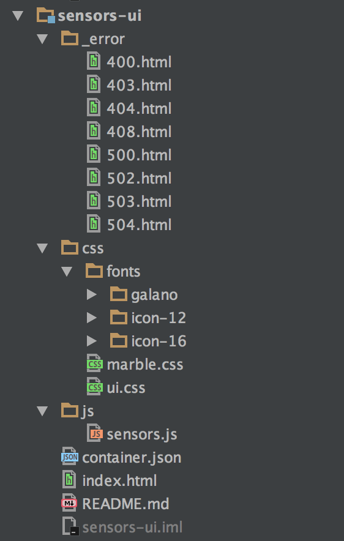

# Microservicio de Interfaz de Usuario

Este microservicio será el responsable de mostrar las métricas almacenadas en el almacenamiento
persistente. Para ello, la interfaz de usuario se ha escrito en HTML5, CSS3 y Javascript del lado del
cliente.

Para consultar los datos relativos a las métricas almacenadas, este microservicio no utiliza el
microservicio de datos, sino que siempre pide estos datos a través del microservicio del API, utilizando
los *endpoints* de lectura expuestos por éste, representados por dos recursos de acceso a las métricas:
el primero recuperando todas las existentes, y el segundo recuperando todas las métricas asociadas a
un sensor. Por tanto se podrá desarrollar una aplicación en la tecnología deseada que permita el
consumo de los datos expuestos por el API REST utilizando los verbos HTTP adecuados.

Para el caso concreto del trabajo, se ha desarrollado una aplicación 

## Estructura del proyecto

El microservicio de interfaz de usuario contiene únicamente un descriptor, propio de **WeDeploy**, en
formato JSON. El descriptor viene definido por el fichero `container.json` que especifica a la
plataforma **WeDeploy** que el servicio actual es del tipo `hosting`, así como le asigna un identificador
único, en este caso `ui`.

```json
{
	"id": "ui",
	"type": "wedeploy/hosting"
}
```

Para consultar el descriptor del servicio de datos, por favor seguir [este enlace](./container.json).

En la siguiente imagen aparecen los elementos antes mencionados:




